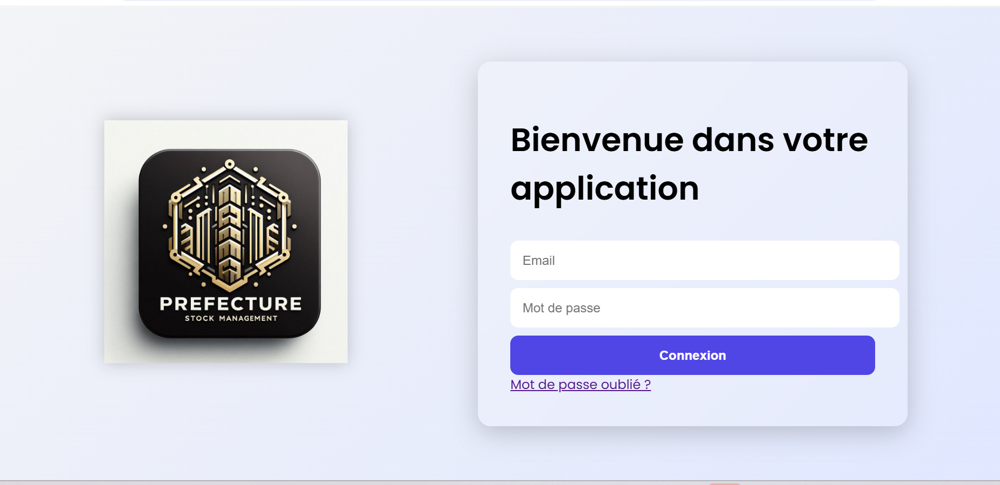
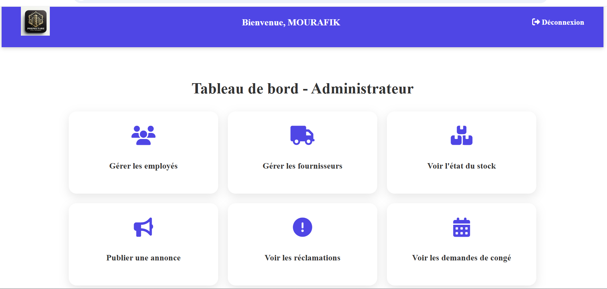
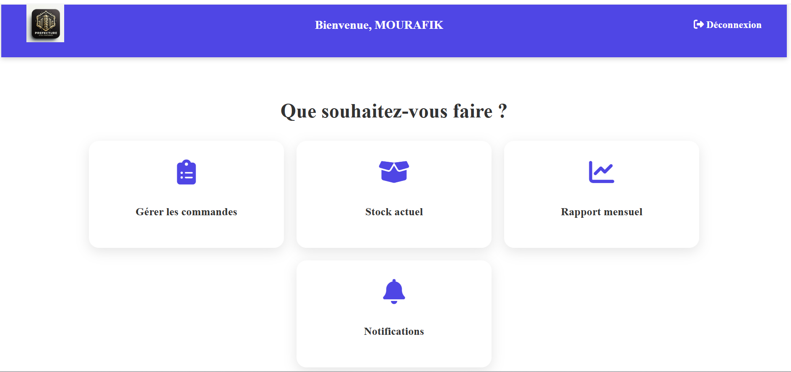

# 📦 PréfectureManager – Gestion de Stock et du Personnel pour la Préfecture


**PréfectureManager** est une application web de gestion destinée aux services de la préfecture. Elle permet un suivi rigoureux des stocks, des commandes, des employés et des fournisseurs. Développée dans le cadre d’un projet académique, elle s’adresse principalement aux magasiniers, aux administrateurs et aux employés pour une gestion simplifiée, sécurisée et centralisée.

---
## 📌 Sommaire

- 🎯 Objectif du projet
- ✨ Fonctionnalités
- 🧠 Architecture & Design
- 🛠️ Technologies utilisées
- 🚀 Installation et Lancement
- 📁 Structure du Projet
- 🧪 Tests
- 🔧 CI/CD et DevOps
- 🖼️ Captures d’écran
- 👩‍💻 Auteur
- 📜 Licence
- 🤝 Contribution
- ---

## 🎯 Objectif du projet

Fournir une solution complète pour automatiser la gestion du stock et du personnel au sein d’une préfecture : suivi des articles, commandes, mouvements de stock, gestion des employés, traitement des réclamations et demandes de congé.

---

## ✨ Fonctionnalités

### 🔐 Authentification
- Connexion sécurisée avec rôles (Administrateur, Magasinier, Employé)

### 👷 Magasinier
- Gérer les articles (Ajouter / Modifier / Supprimer)
- Gérer les commandes
- Visualiser les statistiques du stock
- Consulter les rapports mensuels
- Recevoir des notifications automatiques

### 🧑‍💼 Administrateur
- Gérer les employés
- Gérer les fournisseurs
- Voir l’état du stock (lecture seule)
- Publier des annonces
- Gérer les réclamations
- Traiter les demandes de congé

### 👨‍🔧 Employé
- Modifier son profil
- Envoyer une réclamation
- Lire les annonces
- Faire une demande de congé
- Suivre l'état de la demande

---
## 🛠️ Technologies utilisées

| Technologie           | Rôle                                   |
|-----------------------|----------------------------------------|
| Java                  | Langage principal                      |
| Spring Boot           | Backend, sécurité                      |
| Spring Cache          | Mise en cache des résultats pour améliorer les performances |
| JSP / HTML / CSS      | Frontend (interface utilisateur)       |
| MySQL                 | Base de données relationnelle          |
| JPA / Hibernate       | ORM (mapping des entités)              |
| Python + scikit-learn | Microservice prédiction salaires       |
| GitHub                | Versionnage du code                    |
| Azure DevOps          | CI/CD, gestion de projet, déploiement  |
| Docker                | Conteneurisation des services          |
| JUnit                 | Tests unitaires                        |
| SonarQube             | Analyse qualité du code                |
| Power BI              | Visualisation des rapports             |
| WebSocket             | Système de chat intégré                |


---


## 🚀 Installation et Lancement

### 🔧 Prérequis

- Java 17+
- Apache Tomcat 10 (si usage WAR)
- MySQL 8+
- Maven
- Docker (optionnel)
- Git

### 📝 Étapes

1. Cloner le dépôt :

```bash
git clone https://github.com/imane-mourafik/GestionStock.git
```

2. Configurer la base de données MySQL :

```sql
CREATE DATABASE prefecture_db;
```

3. Modifier les informations de connexion dans `application.properties` :

```properties
spring.datasource.username=root
spring.datasource.password=tonmotdepasse
spring.datasource.url=jdbc:mysql://localhost:3306/prefecture_db
```

4. Lancer le projet :

```bash
mvn spring-boot:run
```

5. Accéder à l’application :

[http://localhost:8080](http://localhost:8080)

---
## 📁 Structure du Projet

```
ProjetPFA/
| data
   | salaire.csv
├── src/
│   ├── main/
│   │   ├── java/
│   │   │   └── com/example/ProjetPFA/
│   │   │       ├── Controller/
│   │   │       ├── Model/
│   │   │       ├── Repository/
│   │   │       ├── Service/
|   |   |       |__config/
|   |   |       |__Utils/          
│   │   │       |
                └── ProjetPfaApplication.java
│   │   └── resources/
│   │       ├── templates/ (JSP)
│   │       ├── static
|   |       |      |__documents
|   |       |                |__Attestation de démission
|   |       |                |__Attestation de mission professionel
|   |       |                |__Attestation de salaire
|   |       |                |__Attestation de travail
|   |       |                |__/CSS
|   |       |                |__/png
│   │       └── application.properties
│   └── test/
│       └── ...
├── pom.xml
└── README.md
|---LICENCE
|--predire_salaire.py
|--entrainer_salaire.py
|__ Dockerfile
|__ Docker-compose
|__entrainer_model.py
|__predire_salaire.py
|__model-salire.pkl
```

---

🔧 CI/CD, DevOps & Méthodologie

🌀 Azure DevOps utilisé pour la gestion complète du cycle de vie du projet : backlog, sprints, boards, et pipelines CI/CD.

🗂️ Méthodologie Scrum respectée tout au long du projet avec une organisation en sprints.

✅ GitHub Actions pour l'intégration continue : compilation, exécution des tests unitaires, analyse de code et packaging automatique.

📦 Docker pour la conteneurisation et la portabilité de l'application Spring Boot.

🌐 SonarQube pour l'analyse de la qualité du code, détection des bugs, code smells et respect des bonnes pratiques.

☁️ Déploiement Cloud possible via Azure, Heroku ou Render, selon les environnements de staging et production.


---
## 🖼️ Captures d’écran

- Page de login  



- Tableau de bord administrateur 



- Tableau de bord Magasinier


- Tableau de bord Employe

  
## 👩‍💻 Auteur

**Équipe PrefectureManager** :
- IMANE MOURAFIK  
  Étudiante en Première année Ingénierie Data Science & Informatique

GitHub : (https://github.com/imane-mourafik/GestionStock.git)  
Contact :imanemourafik2004@gmail.com

---
## 📜 Licence

Ce projet est sous licence **MIT** — tu peux l'utiliser, le modifier et le redistribuer librement, tant que tu respectes les conditions de la licence.

Voir le fichier [`LICENSE`](./LICENSE) pour plus d’informations.

---
## 🤝 Contribution

Tu veux contribuer ?

```bash
1. Forkez le dépôt (copiez-le sur votre propre compte GitHub)
2. Créez une nouvelle branche pour votre fonctionnalité :
   git checkout -b feature/nom-de-la-fonctionnalite
3. Effectuez vos modifications, puis validez-les :
   git commit -m "Ajout de la fonctionnalité X"
4. Poussez vos modifications vers votre dépôt :
   git push origin feature/nom-de-la-fonctionnalite
5. Créez une *Pull Request* pour soumettre vos changements ✨
```

---

Développé avec rigueur et passion pour optimiser la gestion des stocks et améliorer l’organisation administrative des préfectures.

